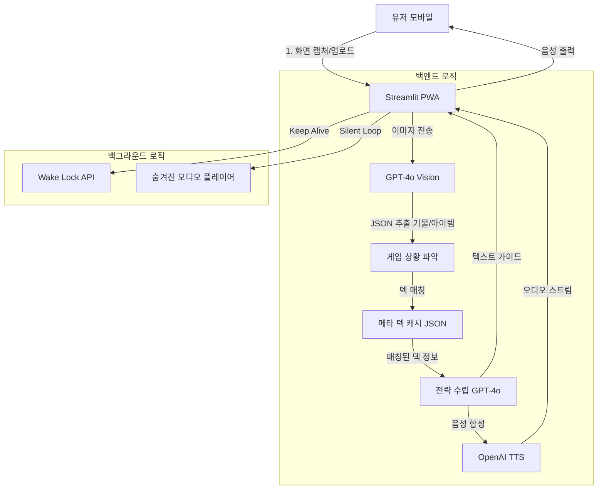

# 🎮 VibeTFT Navigator

모바일 TFT 플레이어를 위한 실시간 음성 기반 전략 코칭 및 덱 전환 가이드

[](https://opensource.org/licenses/MIT)
[](https://www.python.org/downloads/)

## 목차

- [프로젝트 개요](#프로젝트-개요)
- [문제 정의](#문제-정의)
- [솔루션](#솔루션)
- [핵심 기능](#핵심-기능)
- [기술 스택](#기술-스택)
- [시스템 아키텍처](#시스템-아키텍처)
- [데이터 스키마](#데이터-스키마)
- [UI/UX 설계](#uiux-설계)
- [설치 방법](#설치-방법)
- [사용 방법](#사용-방법)
- [개발 마일스톤](#개발-마일스톤)
- [프로젝트 구조](#프로젝트-구조)
- [기여하기](#기여하기)
- [라이선스](#라이선스)

## 프로젝트 개요

**VibeTFT Navigator**는 모바일 환경에서 TFT(전략적 팀 전투)를 플레이하는 유저들을 위한 AI 기반 음성 코칭 도우미입니다.

| 항목 | 내용 |
|------|------|
| 프로젝트명 | VibeTFT (Voice & Vision Navigator) |
| 플랫폼 | 모바일 웹 앱 (PWA) |
| 핵심 기술 | GPT-4o (Vision/Chat), RAG, Streamlit |
| 타겟 유저 | 게임 중 화면 전환 없이 실시간 코칭을 원하는 모바일 TFT 유저 |
| 작성일 | 2025-12-18 (Updated) |

## 문제 정의

**Alt-Tab의 위험성**: 모바일 TFT 플레이어는 공략을 보기 위해 앱을 전환하다가 게임 연결이 끊기거나 턴을 놓침

**입력의 불편함**: 텍스트 타이핑은 불가능하며, 음성 입력만으로는 복잡한 필드 상황(기물 배치, 대기석 아이템 등)을 설명하기 어려움

**배경 실행의 한계**: 모바일 브라우저는 화면이 꺼지거나 백그라운드로 가면 오디오/타이머가 멈추는 기술적 제약이 있음

## 솔루션

**세컨드 스크린 PWA**: 설치 없이 URL로 접속하되, 앱처럼 전체 화면으로 작동하는 세컨드 스크린 서비스

**스냅샷 투 스트래티지**: "말보다 사진" - 카메라로 게임 화면을 찍으면 비전 AI가 상황을 분석해 덱을 추천

**상시 음성 코치**: 무음 오디오 루프 기술을 적용해 백그라운드에서도 죽지 않는 라운드 알리미

## 핵심 기능

### 멀티모달 덱 어드바이저

**킬러 피처**: 기존 텍스트/음성 입력의 한계를 극복하는 핵심 기능

**입력 방식**:
- 카메라/업로드: 현재 게임 화면(상점+필드+대기석) 스크린샷 업로드
- 음성: "지금 이 상황에서 9레벨 갈지 리롤 칠지 봐줘" 같은 추가 질문

**처리 과정**:
- 비전 분석: GPT-4o를 통해 이미지 내 보유 기물(스타 레벨), 아이템, 현재 시너지, 체력/골드 정보를 JSON으로 추출
- RAG 검색: 추출된 정보를 바탕으로 Vector DB(메타 데이터)에서 승률 상위 덱 매칭

**출력**:
- 가장 확률 높은 덱 2가지 추천 및 전환 가이드를 음성(TTS)으로 우선 출력
- 화면에는 요약된 텍스트 카드 표시

### 끊김 없는 게임 흐름 내비게이션

**기술적 난이도**: 상급 - PWA 필수 요건

**Wake Lock**: NoSleep.js 또는 Navigator.wakeLock API를 사용하여 화면 꺼짐 방지

**고스트 오디오 루프**: '게임 시작' 버튼 클릭 시, 0.1초짜리 무음 파일을 무한 루프 재생하여 브라우저 세션 유지

**라운드 동기화**:
- 타이머는 서버 시간이 아닌 클라이언트 타임스탬프 기준으로 계산 (네트워크 지연 방지)
- 2-1, 3-2 등 핵심 라운드 진입 5초 전 TTS 자동 송출

### 메타 데이터 캐싱 시스템

**일일 빌드**: 하루 1회 배치 작업으로 lolchess.gg 데이터를 크롤링

**최적화**: 실시간 검색 부하를 줄이기 위해, S티어/A티어 덱 정보를 LLM이 이해하기 쉬운 요약된 JSON 형태로 로컬/메모리에 캐싱

## 기술 스택

### 프론트엔드/앱
**Streamlit (Python)**
- 애드온: streamlit-webrtc (실시간 미디어 처리), streamlit-javascript (WakeLock 제어)

### AI 코어
- **비전/채팅**: OpenAI gpt-4o (이미지 분석 및 전략 수립)
- **STT**: OpenAI whisper-1
- **TTS**: OpenAI tts-1 (속도 최적화 모델)

### 데이터베이스
- **벡터 DB**: ChromaDB (가이드 텍스트 검색용)
- **캐시**: Simple JSON/Pickle (정형화된 덱 데이터용)

### 데이터 수집
- **BeautifulSoup4**: HTML 파싱
- **Selenium**: 동적 웹페이지 크롤링

## 시스템 아키텍처

### 데이터 플로우



## 데이터 스키마

### 비전 API 출력 스키마

게임 스크린샷 처리 시 GPT가 출력해야 할 JSON 포맷:

```json
{
  "current_status": {
    "stage": "3-2",
    "gold": 42,
    "hp": 68,
    "level": 6
  },
  "inventory": {
    "units": ["Ash_2star", "Ammu_1star", "Lux_2star"],
    "items_on_bench": ["BF Sword", "Recurve Bow"],
    "items_equipped": {"Ash": ["Guinsoo"]}
  }
}
```

## UI/UX 설계

### 메인 레이아웃 (단일 페이지)

**헤더**: 현재 라운드 타이머 (크게) | [RESET] 버튼

**액션 영역** (중앙):
- 카메라 버튼 (가장 큼): 클릭 시 파일 업로드 또는 카메라 구동
- 마이크 버튼: 누르고 있는 동안 녹음

**출력 영역** (하단):
- 현재 추천 덱 요약 (예: "도자기 애쉬로 전환 추천")
- 다음 행동 (예: "4-1에 7레벨 찍으세요")

## 설치 방법

### 사전 요구사항

- Python 3.8 이상
- OpenAI API 키

### 설치 단계

```bash
# 1. 레포지토리 클론
git clone https://github.com/yourusername/VibeTFT-Navigator.git
cd VibeTFT-Navigator

# 2. 가상환경 생성 및 활성화
python -m venv venv
source venv/bin/activate  # Windows: venv\Scripts\activate

# 3. 의존성 설치
pip install -r requirements.txt

# 4. 환경 변수 설정
cp .env.example .env
# .env 파일에 OpenAI API 키 입력
```

### 환경 변수 설정

`.env` 파일에 다음 내용을 추가하세요:

```env
OPENAI_API_KEY=your_openai_api_key_here
```

## 사용 방법

### 1. 데이터 수집 (최초 1회)

```bash
# lolchess.gg에서 메타 데이터 크롤링
python scripts/crawl_meta.py

# Vector DB에 데이터 임베딩
python scripts/build_vectordb.py
```

### 2. 애플리케이션 실행

```bash
streamlit run app.py
```

### 3. 브라우저에서 사용

1. 브라우저가 자동으로 열립니다 (http://localhost:8501)
2. **"게임 시작"** 버튼을 클릭하여 타이머 시작
3. **음성 입력** 버튼을 눌러 질문:
   - "곡궁 2개, 대검 1개 있어. 뭐가 좋아?"
   - "지금 2-5야" (타이머 동기화)
   - "애쉬 덱 어떻게 가?"
4. AI의 음성 안내를 들으며 게임 플레이

## 개발 마일스톤

**전략**: 가장 위험한 기능(오디오/타이머 유지)을 먼저 검증하고, 그 다음 데이터 파이프라인을 구축

### Phase 1: 좀비 테스트 (기술적 PoC) - 최우선

- [ ] Streamlit 배포 환경(모바일)에서 wakeLock 작동 확인
- [ ] 브라우저를 내리고 3분 뒤 다시 켰을 때, 타이머가 흐르고 있는지 확인
- [ ] 화면이 꺼진 상태에서 TTS 오디오가 재생되는지 테스트 (iOS/Android)

### Phase 2: 눈과 귀 (멀티모달 통합)

- [ ] GPT-4o Vision API 연동: 게임 스크린샷 → JSON 파싱 정확도 튜닝
- [ ] Whisper STT + TTS 파이프라인 연결 (지연시간 3초 이내 목표)

### Phase 3: 뇌 (데이터 & 로직)

- [ ] lolchess.gg 크롤링 및 주요 메타 덱 JSON 캐싱
- [ ] 상황별(돈, 체력) 덱 전환 알고리즘 프롬프트 엔지니어링

## 프로젝트 구조

```
VibeTFT-Navigator/
├── docs/                    # 문서 폴더
│   └── PRD.md              # 제품 요구사항 명세서
├── src/                     # 소스 코드
│   ├── crawler/            # 데이터 크롤링 모듈
│   ├── rag/                # RAG 검색 엔진
│   ├── timer/              # 게임 타이머 로직
│   └── audio/              # STT/TTS 처리
├── data/                    # 데이터 저장소
│   ├── raw/                # 크롤링된 원본 데이터
│   ├── processed/          # 가공된 JSON/Markdown
│   └── vectordb/           # ChromaDB 저장소
├── scripts/                 # 유틸리티 스크립트
│   ├── crawl_meta.py       # 메타 데이터 크롤러
│   └── build_vectordb.py   # Vector DB 빌더
├── app.py                   # Streamlit 메인 앱
├── requirements.txt         # Python 의존성
├── .env.example            # 환경 변수 템플릿
└── README.md               # 이 파일
```

## 기여하기

기여는 언제나 환영합니다!

1. Fork the Project
2. Create your Feature Branch (`git checkout -b feature/AmazingFeature`)
3. Commit your Changes (`git commit -m 'Add some AmazingFeature'`)
4. Push to the Branch (`git push origin feature/AmazingFeature`)
5. Open a Pull Request

### 개발 가이드라인

- 코드 스타일: PEP 8 준수
- 커밋 메시지: Conventional Commits 규칙 사용
- 테스트: 새로운 기능은 테스트 코드 포함

## 문서

- [PRD (제품 요구사항 명세서)](docs/PRD.md)
- [API 문서](docs/API.md) (예정)
- [아키텍처 다이어그램](docs/ARCHITECTURE.md) (예정)

## 리스크 및 대응 방안

| 리스크 | 대응 방안 |
|--------|----------|
| STT 인식 오류 | 게임 용어 사전 구축 및 프롬프트 최적화 |
| 사이트 구조 변경 | 모듈화된 파싱 로직으로 유지보수성 확보 |
| 응답 속도 지연 | Top-k 조절 및 경량 모델 사용 |

## 라이선스

이 프로젝트는 MIT 라이선스 하에 배포됩니다. 자세한 내용은 [LICENSE](LICENSE) 파일을 참조하세요.

## 만든 사람

- **AI Architect** - 초기 기획 및 설계
- **Contributors** - [기여자 목록](https://github.com/yourusername/VibeTFT-Navigator/contributors)

## 감사의 말

- [lolchess.gg](https://lolchess.gg) - 메타 데이터 제공
- OpenAI - GPT-4 및 Whisper API
- Streamlit - 빠른 프로토타이핑 도구

---

**Note**: 이 프로젝트는 교육 및 개인 사용 목적으로 제작되었습니다. lolchess.gg의 이용 약관을 준수하며, 상업적 용도로 사용하지 않습니다.

**문의사항**이 있으시면 [Issues](https://github.com/yourusername/VibeTFT-Navigator/issues)에 등록해주세요.